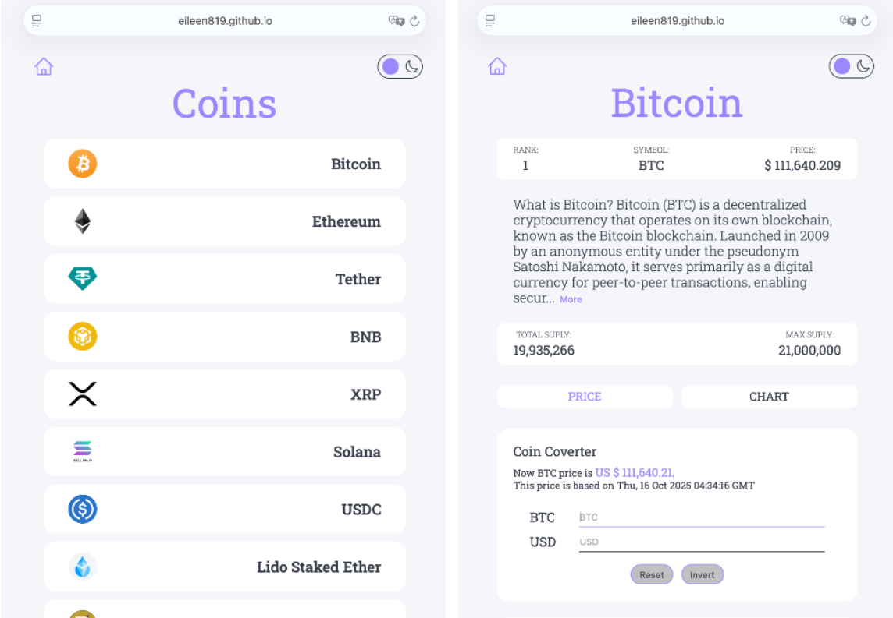
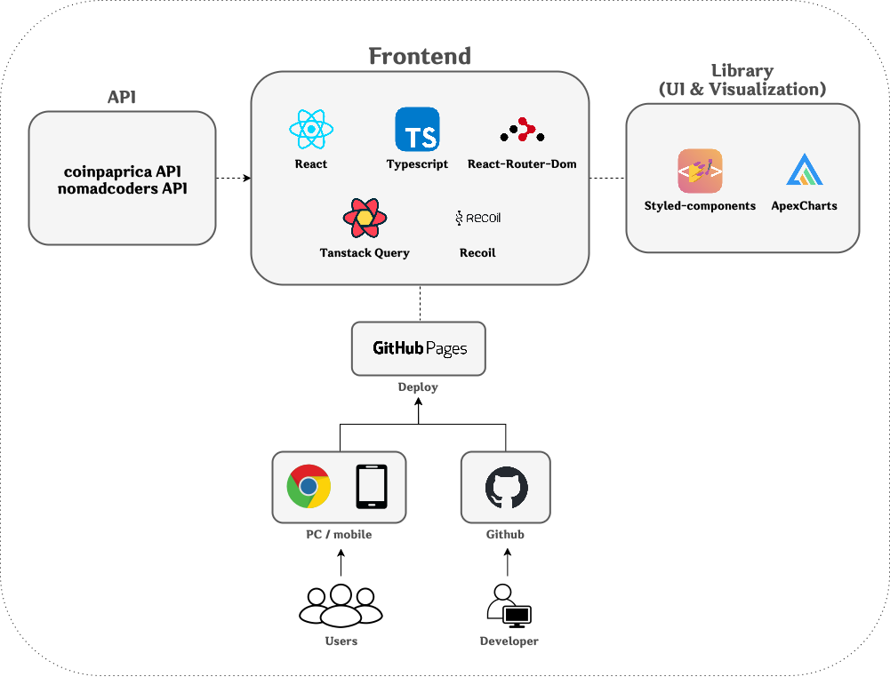

# 📈 Coin-List

### 🔈 전 세계 암호화폐의 실시간 시세와 상세 정보를 확인하세요.


🔗 **Demo:** [Coin List](https://eileen819.github.io/coin-list)

<br/>

## 📌 프로젝트 개요

- **Coin List**는 **실시간 암호 화폐 정보를 제공**하는 웹 어플리케이션입니다.
- React의 컴포넌트 기반 아키텍처를 효과적으로 활용하고, Typescript를 통한 타입 안정성을 확보하는 것에 중점을 두며 개발되었으며, 사용자가 **다양한 암호 화폐의 가격 변동 내역을 쉽게 확인**할 수 있도록 설계되었습니다.
- **차트 및 컨버터 기능**을 통해 데이터를 직관적으로 이해할 수 있도록 하였으며, **다크 모드 지원 및 모바일 최적화 UI**를 제공하여 사용자의 편의성도 극대화하였습니다.

<br/>

## 💡 주요 기능

### ✅ 실시간 코인 가격 및 차트 제공

- 현재 암호 화폐의 가격, 순위를 실시간으로 확인 가능
- 오늘의 High, Low, Opening, Closing 가격 확인 가능
- 실시간 암호 화폐 데이터를 페칭하고 캐싱하여 빠른 UX 제공 (TanStack Query 사용)
- ApexCharts를 사용한 라인 차트 & 캔들 차트 제공 (지난 3주간 데이터 확인 가능)

### ✅ 코인 ↔ USD 변환 기능 (컨버터)

- 암호 화폐 ↔ USD 간 변환 지원
- `useState` 활용하여 상태 관리하며, 실시간 환율을 반영함

### ✅ 다크 모드 지원

- 사용자의 선호에 따라 다크 모드 / 라이트 모드 전환 가능
- Recoil을 활용한 글로벌 상태 관리를 적용
- styled-components의 `ThemeProvider`를 활용해서 스타일링을 적용

### ✅ 모바일 최적화 UI

- 모바일에 최적화된 UI로 어디서든 손쉽게 코인 가격 확인 가능

  <br/>

## 🔎 역할과 기여도

- 개인 프로젝트로 **기획, 설계, 개발 및 배포까지 전 과정을 담당**
- 강의를 통해 배운 것들을 바탕으로 기본 기능을 구현한 후, 실사용자 관점을 반영하여 **캔들 차트 구현, 컨버터 기능, 모바일 최적화 UI** 등을 직접 기획하고 개발하여 프로젝트를 확장
- **React + Typescript 기반으로 프로젝트 아키텍처 설계**
- **ApexCharts를 활용한 차트 시각화**
- **TanStack Query 및 Recoil을 활용한 상태 관리 적용**
- **GitHub Pages를 활용한 배포**

  <br/>

## 🏗️ 시스템 아키텍처

  
 <br/>

## 📁 프로젝트 구조

```
src
 ┣ components
 ┃ ┣ Converter.tsx
 ┃ ┣ Footer.tsx
 ┃ ┗ Header.tsx
 ┣ routes
 ┃ ┣ Chart.tsx
 ┃ ┣ Coin.tsx
 ┃ ┣ Home.tsx
 ┃ ┗ Price.tsx
 ┣ App.tsx
 ┣ api.ts
 ┣ atom.ts
 ┣ index.tsx
 ┣ interface.tsx
 ┣ router.tsx
 ┣ styled.d.ts
 ┗ theme.ts
```

  <br/>

## 🛠️ 사용한 기술 스택

| 분류                 | 기술                                                                |
| -------------------- | ------------------------------------------------------------------- |
| **Frontend**         | React, Typescript, React-Router-Dom, ApexCharts, React-Helmet-Async |
| **State Management** | Recoil, TanStack Query(구 React-Query)                              |
| **Styling**          | styled-components, Styled-Reset                                     |
| **API Integration**  | coinpaprica API, nomadcoders API                                    |
| **Deployment**       | gh-pages                                                            |

<br/>

## 🚀 배포 방법

이 프로젝트는 GitHub의 **GitHub Pages**를 활용하여 배포됩니다.  
React 애플리케이션을 정적 파일로 빌드한 후, `gh-pages` 브랜치에 배포하는 방식입니다.  
코드를 GitHub에 push하는 것만으로는 배포되지 않으며, **수동으로 `npm run deploy` 명령어를 실행해야 업데이트**됩니다.

### 🖥️ 로컬 실행 방법

**프로젝트 클론**

```bash
# 프로젝트 클론
git clone https://github.com/eileen819/coin-list.git
cd coin-list

# 의존성 설치
npm install

# 개발 서버 실행
npm start
```

  <br/>

## 🔄 개선 예정 기능 (업데이트 계획)

### ✔️ 회원가입 / 로그인 기능

- Firebase Authentication으로 이메일·소셜 로그인 구현 예정

### ✔️ 즐겨찾기(북마크) 기능

- Firestore 연동으로 사용자별 북마크 저장 및 실시간 동기화

### ✔️ 사용자 맞춤 단위(%, 원, 달러) 표시 옵션

- 가격 및 변동률을 사용자 설정 단위(%, 원, 달러) 로 변환하여 표시
- zustand 또는 Recoil을 이용해 전역 상태로 관리

<br/>

## 📚 기술적 학습 및 인사이트

### 📍 React + Typescript 기반 프로젝트 아키텍처 설계

- Create-React-App을 사용하여 React 기반의 프로젝트 아키텍처를 설계하고, Typescript를 적용하여 안정적인 컴포넌트 설계하는 방식을 경험
- Props 및 State의 타입을 정의하여 런타임 오류 방지 및 코드 가독성 향상시킴

### 📍 styled-components를 활용한 UI 설계

- CSS-in-JS 방식을 사용하여 컴포넌트 기반의 스타일링 적용함
- `ThemeProvider`와 `createGlobalStyle`을 활용하여 전역 테마 시스템을 구현할 수 있었음

### 📍 TanStack Query 및 Recoil을 활용한 상태 관리

- `useQuery`를 활용하여 비동기 데이터 페칭 및 캐싱으로 사용자 친화적 UX를 구현함
- TanStack Query의 사용은 기존의 `useEffect + fetch`를 이용한 비동기 데이터 관리보다 비동기 로직과 캐싱/에러/로딩 상태를 통합적으로 처리할 수 있어 생산성과 유지보수성이 향상됨을 체감
- Recoil의 `atom`을 활용하여 글로벌 상태를 관리하며, `localStorage`를 통한 사용자 설정을 유지하도록 구현할 수 있었음

### 📍 ApexCharts를 활용한 차트 구현

- ApexCharts의 `Chart`컴포넌트를 활용하여 쉽게 라인 차트 & 캔들 차트를 구현함
- 실시간 암호화폐 가격 데이터를 차트로 시각화하는 방법을 학습함

### 📍 GitHub Pages를 활용한 배포

- `gh-pages`패키지를 사용하여 간편하게 정적 React 앱 배포하는 방법을 학습

  <br/>

## 🪪 License

This project is licensed under the MIT License - see the [LICENSE](LICENSE) file for details.

  <br/>
